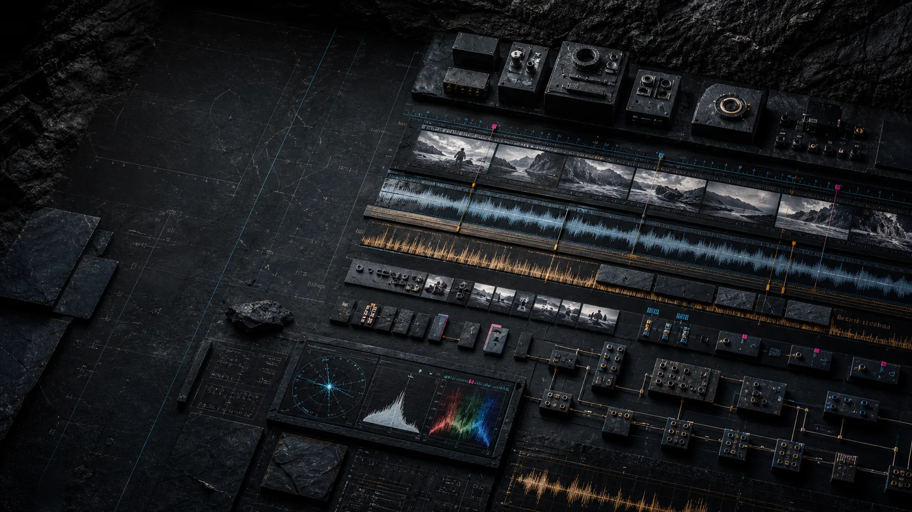

<p align="center">
  <a href="https://kyanitelabs.tech">
    
  </a>
</p>

<!-- mcp-name: io.github.KyaniteLabs/mcp-video -->

<h1 align="center">mcp-video</h1>

<p align="center">
  <strong>Guardrailed video editing MCP server for AI agents.</strong><br>
  Structured tools for FFmpeg video editing, cinematic prompt planning, media analysis, subtitles, audio, effects, Hyperframes video creation, local repurposing packages, and preflight validation that helps prevent silent bad media output.
</p>

<p align="center">
  <a href="https://pypi.org/project/mcp-video/"></a>
  <a href="https://github.com/KyaniteLabs/mcp-video/actions/workflows/ci.yml"></a>
  
  
  
  <a href="https://registry.modelcontextprotocol.io/servers/io.github.KyaniteLabs/mcp-video"></a>
</p>

<p align="center">
  <a href="#install">Install</a> &bull;
  <a href="#quick-start">Quick Start</a> &bull;
  <a href="#what-agents-can-do">Agent Workflows</a> &bull;
  <a href="#tool-surface">Tools</a> &bull;
  <a href="docs/TOOLS.md">Tool Reference</a> &bull;
  <a href="docs/AI_AGENT_DISCOVERY.md">AI Discovery</a> &bull;
  <a href="#agent-skill">Agent Skill</a> &bull;
  <a href="llms.txt">llms.txt</a> &bull;
  <a href="https://registry.modelcontextprotocol.io/servers/io.github.KyaniteLabs/mcp-video">MCP Registry</a>
</p>

---

## Public Discovery

**mcp-video** is a free, open-source **Model Context Protocol (MCP) server**, Python library, and CLI that gives AI agents a real video-editing surface. It wraps FFmpeg, PUSHING CREATION-style planning, media analysis, quality checks, subtitles, audio generation, effects, Hyperframes 0.5 rendering, local repurposing packages, and guardrails for risky edit parameters behind structured tool schemas.

Best-fit searches:

- video editing MCP server
- AI agent video editing
- FFmpeg MCP tools
- Claude Code video editing
- Cursor MCP video tools
- Python video editing library
- subtitle automation
- reels and shorts automation
- agentic media pipeline
- local AI video workflow
- Hyperframes video creation
- YouTube Shorts repurposing

## Why It Exists

AI agents can write FFmpeg commands, but they should not have to guess flags, parse brittle stderr, or silently publish broken media. mcp-video gives agents typed operations, inspectable tool metadata, structured results, preflight guardrails, and quality checkpoints so a video workflow can be automated and reviewed without turning into shell-command roulette.

Use it when you want an AI assistant to:

- trim, merge, resize, crop, rotate, transcode, or export video;
- add text, subtitles, watermarks, overlays, filters, fades, effects, and transitions;
- extract audio, normalize audio, synthesize audio, add generated audio, or create waveforms;
- detect scenes, make thumbnails, generate storyboards, compare quality, and create release checkpoints;
- scaffold cinematic projects, read STYLE_/NEG_ blocks, parse storyboard tables, and expand shot prompts;
- create new Hyperframes projects, inspect rendered layouts, capture websites, generate local speech, remove backgrounds, and post-process the result with FFmpeg tools;
- repurpose one source video into vertical, horizontal, and square local delivery packages with manifests and review artifacts;
- drive repeatable media workflows from Claude Code, Cursor, Codex-style clients, scripts, or CI.

## Installation

Prerequisite: [FFmpeg](https://ffmpeg.org/) must be installed and available on `PATH`.

```bash
# macOS
brew install ffmpeg

# Ubuntu/Debian
sudo apt install ffmpeg
```

Run without a global install:

```bash
uvx --from mcp-video mcp-video doctor
```

Or install with pip:

```bash
pip install mcp-video
mcp-video doctor
```

Hyperframes tools additionally need Node.js 22+ and a resolvable Hyperframes CLI. Install/pin Hyperframes in the active Node package layout, add `hyperframes` to `PATH`, or set `MCP_VIDEO_HYPERFRAMES_COMMAND`.

## Quick Start

### Claude Code

```bash
claude mcp add mcp-video -- uvx --from mcp-video mcp-video
```

### Claude Desktop

```json
{
  "mcpServers": {
    "mcp-video": {
      "command": "uvx",
      "args": ["--from", "mcp-video", "mcp-video"]
    }
  }
}
```

### Cursor

```json
{
  "mcpServers": {
    "mcp-video": {
      "command": "uvx",
      "args": ["--from", "mcp-video", "mcp-video"]
    }
  }
}
```

Then ask your agent:

> Trim this interview into a 45-second vertical clip, add burned captions, normalize the audio, make a thumbnail, and create a release checkpoint before export.

## Agent Skill

mcp-video includes a public agent skill at [`skills/mcp-video/SKILL.md`](skills/mcp-video/SKILL.md). Use `$mcp-video` in compatible agent hosts when you want the agent to choose between the MCP server, CLI, and Python client while preserving the inspect, edit, verify, and human-review workflow.

## Python Client

```python
from mcp_video import Client

editor = Client()

clip = editor.trim("interview.mp4", start="00:02:15", duration="00:00:45")
caption_file = "captions.srt"
editor.ai_transcribe(clip.output_path, output_srt=caption_file)
captioned = editor.subtitles(clip.output_path, subtitle_file=caption_file)
vertical = editor.resize(captioned.output_path, aspect_ratio="9:16")
checkpoint = editor.release_checkpoint(vertical.output_path)

print(checkpoint["thumbnail"])
print(checkpoint["storyboard"])
```

## CLI

```bash
mcp-video info interview.mp4
mcp-video trim interview.mp4 -s 00:02:15 -d 45
mcp-video video-ai-transcribe clip.mp4 --output captions.srt
mcp-video subtitles clip.mp4 captions.srt
mcp-video resize clip.mp4 --aspect-ratio 9:16
mcp-video video-quality-check clip.mp4
mcp-video repurpose clip.mp4 --platforms youtube-shorts instagram-reel tiktok
```

## What Agents Can Do

| Workflow | Example prompt |
| --- | --- |
| Social clips | "Turn this landscape recording into a captioned TikTok and YouTube Short." |
| Podcast production | "Find the strongest segment, trim it, normalize audio, add chapters, and export." |
| Product demos | "Create a short launch video from screenshots, title cards, and voiceover." |
| Cinematic planning | "Create a style pack and storyboard, then render shot prompts for generation." |
| Quality review | "Compare these two exports, make thumbnails, and flag visual or audio problems." |
| Batch automation | "Convert this folder of clips to web-ready MP4 with consistent loudness." |
| Code-created video | "Scaffold a Hyperframes composition, inspect it, render it, then add subtitles and a watermark." |
| Local repurposing | "Turn this master clip into Shorts, Reels, TikTok, and YouTube assets with thumbnails and a manifest." |

## MCP Tools

mcp-video currently registers **119 MCP tools**. The table below summarizes the documented core categories; `search_tools` lets agents discover the exact operation they need without loading every tool description into context.

| Category | Count | Highlights |
| --- | ---: | --- |
| Core video editing | 32 | trim, merge, resize, crop, rotate, convert, overlays, subtitles, export, cleanup, templates, merge-compatibility guardrails |
| Cinematic creation | 4 | project scaffold, style-pack parsing, storyboard parsing, shot prompt expansion |
| AI-assisted media | 11 | transcription, scene detection, upscaling, stem separation, silence removal, color grading |
| Hyperframes | 18 | init, preview, render, snapshots, inspect, catalog, website capture, local TTS, transcription, background removal, diagnostics, benchmark, post-process |
| Repurposing | 2 | dry-run manifests, platform-ready variants, thumbnails, storyboards, release checkpoints |
| Procedural audio | 7 | synthesize, compose, presets, effects, sequences, generated audio, spatial audio, mix-parameter guardrails |
| Visual effects | 8 | vignette, glow, noise, scanlines, chromatic aberration, luma key, mask, shape mask, bounded filter parameters |
| Transitions | 3 | glitch, morph, pixelate |
| Layout and motion | 6 | grid, picture-in-picture, split-screen, animated text, counters, progress bars, auto-chapters, layout mismatch warnings |
| Analysis | 8 | scene detection, thumbnail, preview, storyboard, quality compare, metadata, waveform, release checkpoint |
| Image analysis | 3 | extract colors, generate palettes, analyze product images |
| Discovery | 1 | `search_tools` |

```python
from mcp_video import Client

editor = Client()
matches = editor.search_tools("subtitle")
print(matches["tools"])
```

Full reference: [docs/TOOLS.md](docs/TOOLS.md)

## Agent-Safe Workflow

For autonomous agents, the intended path is inspect, edit, verify, then ask a human to review release artifacts:

```python
from mcp_video import Client

client = Client()

print(client.inspect("trim"))

result = client.pipeline(
    [
        {"op": "trim", "input": "source.mp4", "start": "00:01:00", "duration": "00:00:45"},
        {"op": "add_text", "text": "Launch clip", "position": "top-center"},
        {"op": "normalize_audio"},
        {"op": "resize", "aspect_ratio": "9:16"},
        {"op": "export", "quality": "high"},
        {"op": "release_checkpoint"},
    ],
    output_path="final-short.mp4",
)
```

Safety contract:

- Media-producing calls return structured results with output paths.
- High-risk edit paths now run preflight guardrails before FFmpeg execution: filter bounds, merge compatibility, audio mix volume/timing, overlay/watermark/chroma opacity and similarity, animated text timing/overflow, and grid/split-screen mismatch warnings.
- Analysis and discovery calls return structured JSON reports.
- Tool discovery is available through `search_tools()` and `Client.inspect()`.
- Unexpected keyword errors are converted into actionable `MCPVideoError` guidance.
- Do not publish agent-generated video without `video_quality_check`, `video_release_checkpoint`, and human visual/audio inspection.

## Documentation

- [Tool reference](docs/TOOLS.md)
- [Python client reference](docs/PYTHON_CLIENT.md)
- [CLI reference](docs/CLI_REFERENCE.md)
- [AI agent discovery guide](docs/AI_AGENT_DISCOVERY.md)
- [FAQ](docs/faq.md)
- [llms.txt](llms.txt)

## Testing

Development verification lives in [docs/TESTING.md](docs/TESTING.md). Keep public-surface, media workflow, and security checks current when changing tool behavior.

## Development

```bash
git clone https://github.com/KyaniteLabs/mcp-video.git
cd mcp-video
python3 -m venv .venv
source .venv/bin/activate
pip install -e ".[dev]"
pytest tests/ -v -m "not slow and not hyperframes"
```

## Community

- [Contributing](CONTRIBUTING.md)
- [Code of Conduct](CODE_OF_CONDUCT.md)
- [Governance](GOVERNANCE.md)
- [Maintainers](MAINTAINERS.md)
- [Security](SECURITY.md)
- [Support](SUPPORT.md)
- [Roadmap](ROADMAP.md)
- [Changelog](CHANGELOG.md)
- [GitHub Discussions](https://github.com/KyaniteLabs/mcp-video/discussions)

## License

Apache 2.0. See [LICENSE](LICENSE).

Built with [FFmpeg](https://ffmpeg.org/), [Hyperframes](https://hyperframes.io/), and the [Model Context Protocol](https://modelcontextprotocol.io/).

---

## Part of KyaniteLabs

More from [KyaniteLabs](https://kyanitelabs.tech). Related projects:

- **[Epoch](https://github.com/KyaniteLabs/Epoch)** — time-estimation MCP server (PERT) for AI agents
- **[DialectOS](https://github.com/KyaniteLabs/DialectOS)** — Spanish dialect localization MCP server & CLI
- **[checkyourself](https://github.com/KyaniteLabs/checkyourself)** — local-first production-readiness checks for AI-built code

→ More at **[kyanitelabs.tech](https://kyanitelabs.tech)**
